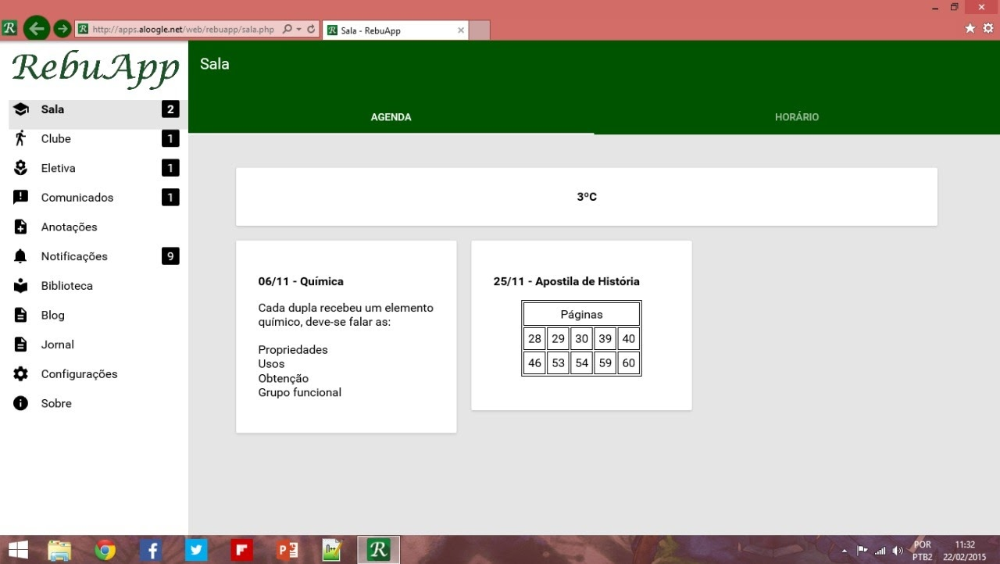
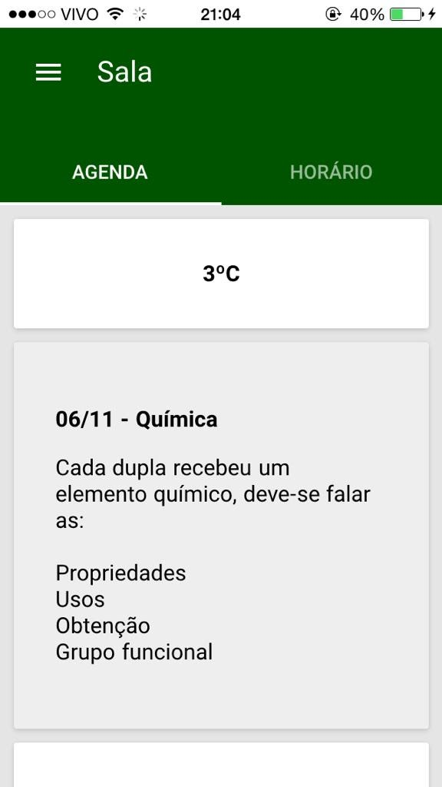
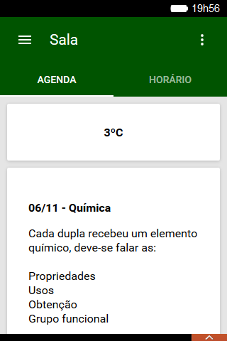
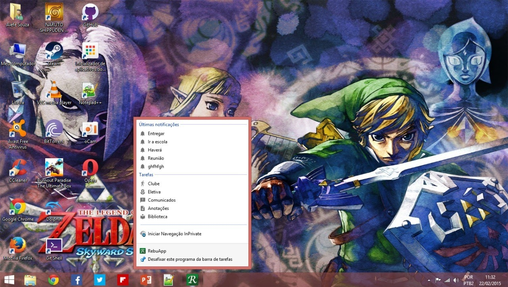
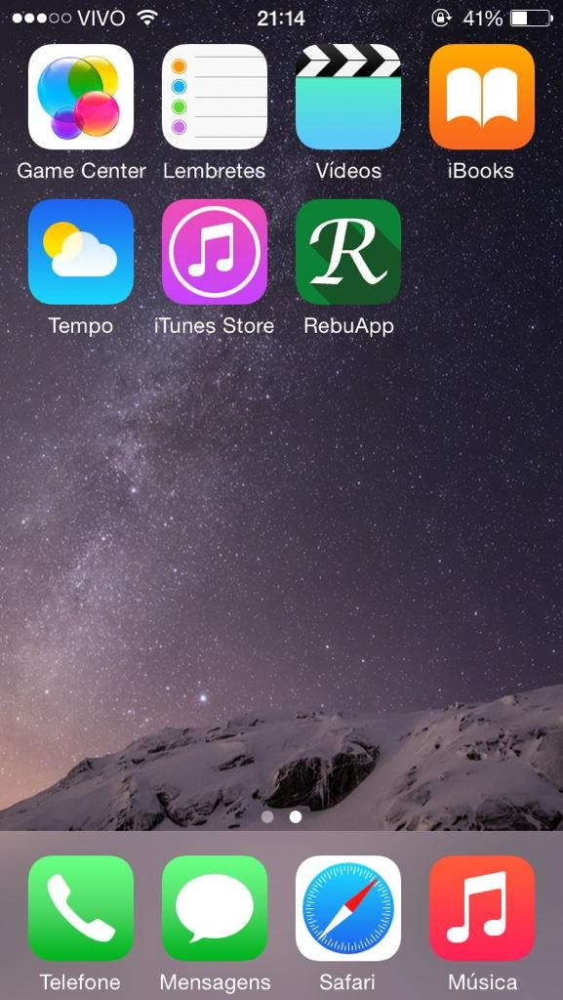
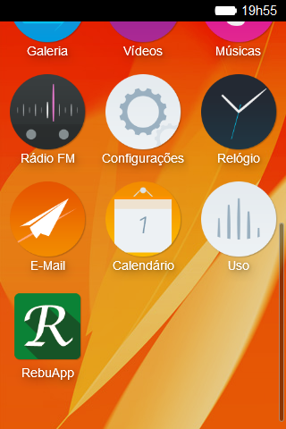
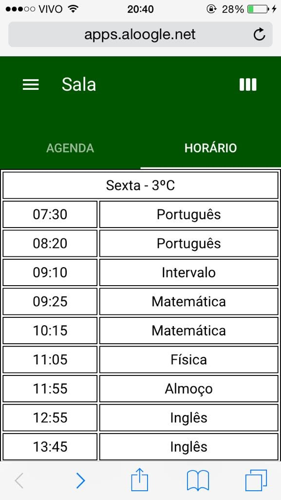
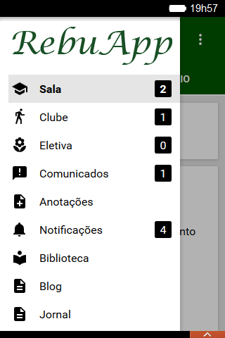

RebuApp
=====

This repository contains the back-end code for RebuApp, an application I developed in my third year of high school to help students with schedules and agendas for each classroom in the school.

I also recommend reading the README.md of the previous version; to do so, [click here](https://github.com/alefesouza/schoolapp-backend/tree/58ed254646a9e358cb63562a8a452dd763c5b17b).

Version 1.x of the Android application only displayed web pages, while version 2 onwards became a more native application, receiving JSON from the server and processing it in the Android interface. It was practically my first project of this type, when I had just turned 18.

Since I received many complaints from iOS and Windows Phone users because the app only supported Android, I also created a web version identical to the Android app, using Polymer's Material Design, which was still in beta. You can check the code in the webapp folder. I made it a true web application, trying to integrate as much as possible with each system. For example, if you pin a tile to Windows, the tile will display the latest events and notifications. You can see all the integrations by [clicking here](http://apps.aloogle.net/web/rebuapp/facilidades.php).

## Screenshots

| Windows | Win Phone | iOS | Firefox OS |
|-|-|-|-|
|  |  |  |  |
|  |  |  |  |
|  |  |  |  |

Screenshots of the evolution of the app inside [./Screenshots/Evolution](./Screenshots/Evolution/).

There's also the Android app [in this repository](https://github.com/alefesouza/schoolapp).

I also developed a Google Chrome extension for RebuApp. To visit its repository, [click here](https://github.com/alefesouza/schoolapp-chrome).

Keep in mind that since this is code from when I started developing in PHP, you'll see many bad practices. Back then, I didn't even know what that was. I even remember using `if($string == $valor_da_coluna)` because I didn't know about the SQL `WHERE` clause, haha, and I also used `$_GET[""]` for everything, used multiple `if($string == "") {} else if ($string == "") {}` instead of `switch`, wrote JSON instead of using `json_encode(array("key" => "value"))`, and many other beginner mistakes. So don't think I still make these errors today; just look at the back-end of my most recent personal project (https://github.com/alefesouza/gdg-sp/tree/master/Back-end).

The SQL folder contains a backup of the database used in the application.

##### Portuguese

Nesse repositório há o código do back-end do RebuApp, aplicativo que desenvolvi no terceiro ano do ensino médio, visando ajudar os alunos com horários e agenda de cada sala da escola.

Recomendo também ler o README.md da versão anterior, para isso, [clique aqui](https://github.com/alefesouza/schoolapp-backend/tree/58ed254646a9e358cb63562a8a452dd763c5b17b).

A versão 1.x do aplicativo para Android só exibia páginas web, já a partir da versão 2 do mesmo ele já eu um aplicativo mais nativo, recebendo JSON do servidor e tratando na interface do Android, foi praticamente meu primeiro projeto desse tipo, quando tinha acabado de fazer 18 anos.

Como recebia muitas reclamações de quem usava iOS e Windows Phone por o aplicativo só ter suporte para Android, fiz tambám [uma versão web](http://apps.aloogle.net/web/rebuapp) idêntica ao aplicativo para Android, utilizando o Material Design do Polymer que ainda estava em beta, você pode checar o código na pasta webapp. Fiz dele um verdadeiro aplicativo web tentando integrar o máximo possível que cada sistema permitia, por exemplo caso fixe uma tile dele no Windows, a tile exibirá os últimos eventos e notificações, você pode ver todas as integrações [clicando aqui](http://apps.aloogle.net/web/rebuapp/facilidades.php).

Também desenvolvi uma extensão para Google Chrome para o RebuApp, para visitar o repositório dela, [clique aqui](https://github.com/alefesouza/schoolapp-chrome).

Leve em consideração que por ser um código de quando comecei a desenvolver em PHP você verá muitas más-práticas, na época eu nem sabia o que era isso, lembro até que coloquei um if($string == $valor_da_coluna) porque não sabia do WHERE do SQL huehaheu, e também usava $_GET[""] pra tudo, usar vários if($string == "") {} else if ($string == "") {} ao invés de switch, escrever o JSON ao invés de usar json_encode(array("key" => "value")) e muitas outras coisas de iniciante, portanto não pense que hoje em dia eu continuo cometendo esse erros, só olhar o [back-end do meu projeto pessoal mais recente](https://github.com/alefesouza/gdg-sp/tree/master/Back-end).

Na pasta SQL tem um backup do banco de dados utilizado na aplicação.

Licença
-----

    Copyright (C) 2015 Alefe Souza <contato@alefesouza.com>

    Licensed under the Apache License, Version 2.0 (the "License");
    you may not use this file except in compliance with the License.
    You may obtain a copy of the License at

        http://www.apache.org/licenses/LICENSE-2.0

    Unless required by applicable law or agreed to in writing, software
    distributed under the License is distributed on an "AS IS" BASIS,
    WITHOUT WARRANTIES OR CONDITIONS OF ANY KIND, either express or implied.
    See the License for the specific language governing permissions and
    limitations under the License.
